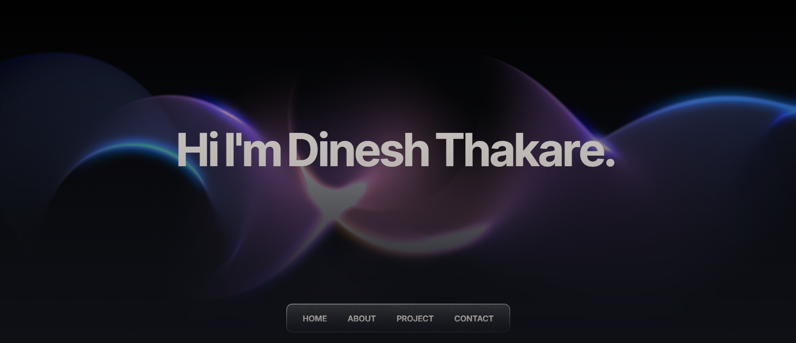

<div align="center">
<a href="https://github.com/dineshthakare/your-repo-name">
 
  </a>
    <h1 align="center">Dinesh Thakare's Portfolio</h1>
  <p align="center">
   A modern and responsive developer portfolio showcasing my skills, projects, and experience.
  </p>
  <p>
    
   <a href="https://www.eldoraui.site/">Visit site</a>
    ·
    <a href="https://github.com/dineshthakare/dineshthakare-portfolio-/issues">Report Bug</a>
    ·
    <a href="https://github.com/dineshthakare/dineshthakare-portfolio-/issues">Request Feature</a>
  </p>
</div>

<!-- ABOUT THE TEMPLATE -->

<div align="center">

 

 
</div>

# Portfolio 

Minimalist developer portfolio using Next.js 14, React, TailwindCSS, Framer motion

# Features

- Built using Next.js 14, React, Typescript, Shadcn/UI, TailwindCSS, Framer Motion, Eldora UI
- Responsive for different devices
- Optimized for Next.js and Vercel

# Getting Started Locally

1. Clone this repository to your local machine:

   ```bash
   git clone https://github.com/dineshthakare/dineshthakare-portfolio-.git
   ```

2. Move to the cloned directory

   ```bash
   cd dineshthakare-portfolio-
   ```

3. Install dependencies:

   ```bash
   npm install
   ```

4. Start the local Server:

   ```bash
   npm run dev
   ```


# License

Licensed under the [MIT license](https://github.com/dineshthakare/dineshthakare-portfolio-/blob/main/LICENSE.md).
